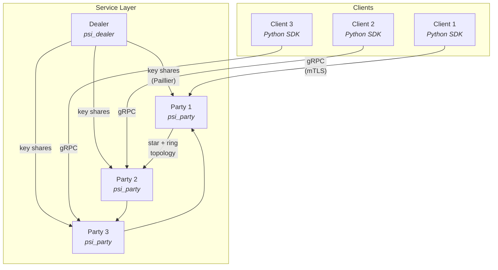

# multiparty-psi-protocols-experimental

Experimental implementations of multi-party Private Set Intersection (PSI) protocols for research and evaluation.

## Protocols

| Protocol | Reference | Experiment | Service |
|----------|-----------|------------|---------|
| KS05 Threshold MPSI | Kissner & Song, CRYPTO 2005 [[doi]](https://doi.org/10.1007/11535218_15) | [experiments/ks05](experiments/ks05/) | [service](service/) |
| BEH21 Threshold MPSI | Bay et al., IEEE TIFS 2021 [[doi]](https://doi.org/10.1109/TIFS.2021.3118879) | [experiments/beh21](experiments/beh21/) | — |
| YYH26 T-Threshold MPSI | TBD, NDSS 2026 | [experiments/yyh26](experiments/yyh26/) | [service](service/) |

The repository has two layers:

- **`experiments/`** — Standalone academic reference implementations that communicate over plaintext TCP. Useful for benchmarking and understanding each protocol in isolation.
- **`service/`** — A gRPC-based production framework with mTLS, threshold key distribution, per-request protocol selection, and a Python client SDK. See [service/README.md](service/README.md) for the full usage guide.

## Architecture



## Prerequisites

### Core (service)

- C++20 compiler (GCC 10+ or Clang 15+)
- CMake 3.16+
- [NTL](https://libntl.org/) (Number Theory Library)
- [GMP](https://gmplib.org/) (GNU Multiple Precision)
- [gRPC](https://grpc.io/) and [Protobuf](https://protobuf.dev/)

```bash
# Ubuntu/Debian
sudo apt install build-essential cmake libntl-dev libgmp-dev libgrpc++-dev protobuf-compiler-grpc libprotobuf-dev
```

### Experiments (KS05/BEH21)

All of the above, plus:

- [Boost](https://www.boost.org/) (system, thread, ASIO)
- [cryptoTools](https://github.com/ladnir/cryptoTools), [coproto](https://github.com/Visa-Research/coproto), [volePSI](https://github.com/Visa-Research/volePSI), [libOTe](https://github.com/osu-crypto/libOTe)

```bash
sudo apt install libboost-all-dev
```

### YYH26 (experiment or service)

All of the above, plus:

- nasm, MPFR, Google Benchmark
- Miracl, libOTe, libOLE (built from source via setup scripts)

```bash
sudo apt install nasm libmpfr-dev libbenchmark-dev
```

For the YYH26 experiment, see [experiments/yyh26/README.md](experiments/yyh26/README.md) for build instructions.
For YYH26 in the service, see [service/README.md](service/README.md#yyh26-tt-mpsi-protocol).

## Quick Start

### Service (recommended)

```bash
mkdir -p build && cd build
cmake ..
make -j$(nproc)
```

This produces `psi_party` and `psi_dealer` under `build/service/`.

Run the demo:

```bash
bash service/demos/ks05/demo.sh      # 3-party KS05 with dealer
bash service/demos/yyh26/demo.sh     # 3-party YYH26 without dealer
```

See [service/README.md](service/README.md) for usage, mTLS setup, and API reference.

### Experiments

```bash
mkdir -p build && cd build
cmake .. -DBUILD_EXPERIMENTS=ON
make -j$(nproc)
```

Per-protocol flags: `-DBUILD_KS05=ON` (default), `-DBUILD_BEH21=ON` (default), `-DBUILD_YYH26=OFF` (requires extra deps).

Binaries are produced under `build/experiments/<protocol>/`.

## Structure

```
multiparty-psi-protocols-experimental/
├── experiments/          # Academic reference implementations (plaintext TCP)
│   ├── shared/          # Shared crypto (paillier, defines, logger)
│   ├── ks05/            # Kissner-Song CRYPTO'05 T-MPSI
│   ├── beh21/           # Bay et al. TIFS'21 OT-MPSI
│   ├── yyh26/           # YYH26 NDSS'26 TT-MPSI
│   └── tools/           # Shared benchmark scripts
└── service/             # gRPC service framework (mTLS, dealer, Python client)
    ├── proto/           # Protobuf definitions
    ├── core/            # Shared transport layer and protocol registry
    ├── protocols/       # Protocol implementations (ks05, yyh26)
    ├── party/           # Client-facing gRPC service (psi_party binary)
    ├── dealer/          # Key dealer service (psi_dealer binary)
    ├── clients/python/  # Python client SDK
    ├── demos/           # End-to-end demo scripts
    ├── certs/           # mTLS certificate generation
    └── tests/           # Integration and unit tests
```

## Disclaimer

This repository contains experimental implementations for research and evaluation purposes.
